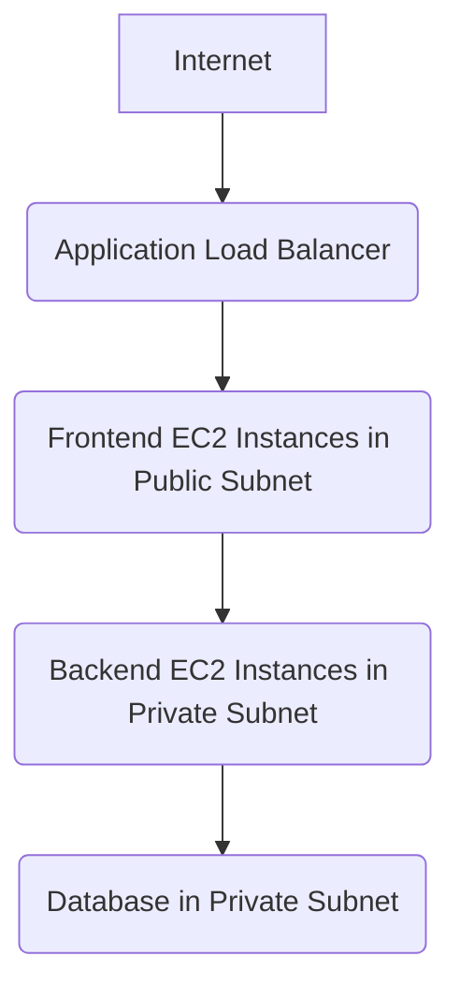

# AWS Three-Tier Web Application Deployment (Terraform)

This project demonstrates how to deploy a scalable and secure **three-tier web application** architecture on **AWS** using **Terraform** as Infrastructure as Code.

---

## Project Overview

The architecture includes:

- **Presentation Layer** - Public-facing frontend hosted on EC2 (or optionally S3).
- **Application Layer** - Backend services running securely in Private Subnets (EC2).
- **Data Layer** - Relational Database using Amazon RDS (Mysql/Postgresql).

# High-Level Architecture Diagram

The infrastructure is **fully automated** using Terraform.

---

## Technologies Used

- **AWS** – EC2, RDS, VPC, ALB, Security Groups  
- **Terraform** – Infrastructure as Code  
- **Git & GitHub**  
- **Remote Backend (S3 + DynamoDB)** – For Terraform state management  

---

## Project Structure
```bash
├aws-three-tier-app/
├── main.tf              # Main infrastructure configuration
├── variables.tf         # Input variables
├── outputs.tf           # Output values
├── vpc.tf               # VPC, Subnets, and Internet Gateway setup
├── ec2.tf               # EC2 instances for frontend and backend
├── rds.tf               # RDS instance (Mysql/Postgresql)
├── alb.tf               # Application Load Balancer configuration
├── security-groups.tf   # Security Groups
├── remote-backend.tf    # S3 + DynamoDB backend for Terraform state
├── user-data.sh         # Bootstrap script for EC2 initialization
```
---
## How to Deploy

1. **Clone the repo**
   ```bash
   git clone https://github.com/UcheOfiani-CloudProjects/aws-three-tier-app.git
   cd aws-three-tier-app
   terraform init     # initialize terraform
   terraform validate  # vaildate the configuration
   terraform plan    # preview changes
   terraform apply   # deploy the infrastructure
``
   ## Issues Faced & Solutions

1. **Large File (>100MB) Pushed to GitHub**
We accidentally committed the Terraform AWS provider .exe binary file:

```bash
.terraform/providers/registry.terraform.io/hashicorp/aws/5.95.0/windows_amd64/terraform-provider-aws_v5.95.0_x5.exe
```
GitHub has a file size limit of 100MB.

# Solution
```bash
git filter-branch --force --index-filter \
  "git rm --cached --ignore-unmatch .terraform/providers/registry.terraform.io/hashicorp/aws/5.95.0/windows_amd64/terraform-provider-aws_v5.95.0_x5.exe" \
  --prune-empty --tag-name-filter cat -- --all

git push origin --force --all
```

2. **Merge Conflicts due to main.tf**
After pulling from GitHub, a merge conflict occurred due to an untracked local main.tf.

# Solution:
We moved or removed the conflicting file manually, then continued the pull:

```bash
mv main.tf main.tf.bak
git pull
```
### Security Considerations
Public access is restricted to only the load balancer.
Backend and database tiers are isolated in private subnets.
Security groups are tightly scoped to necessary traffic only.

### Lessons Learned
Add .terraform/ to .gitignore to avoid committing provider binaries.
Handle untracked files carefully before merging/pulling.
Use git filter-branch or git filter-repo to remove large files from Git history.

### License
This project is licensed under the MIT License.

### About
This project was created to demonstrate deploying production-grade, secure, and scalable infrastructure on AWS using Terraform best practices.

